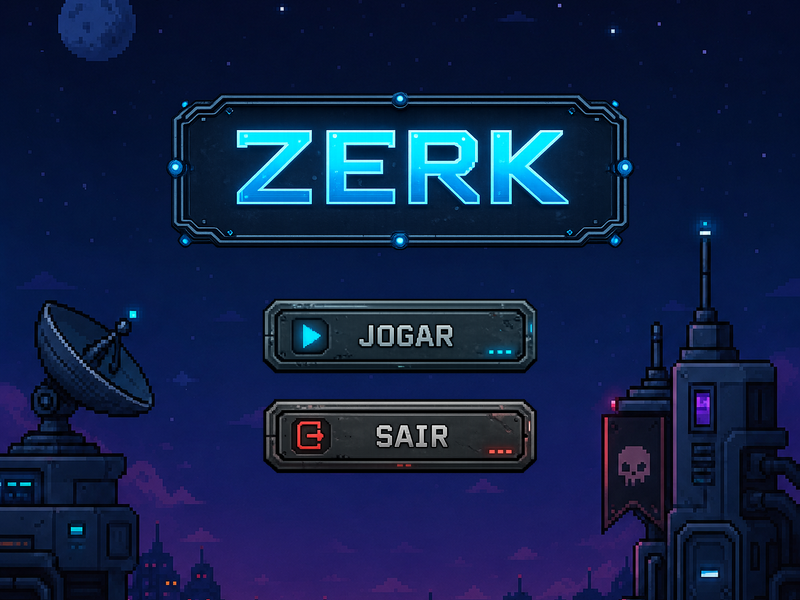
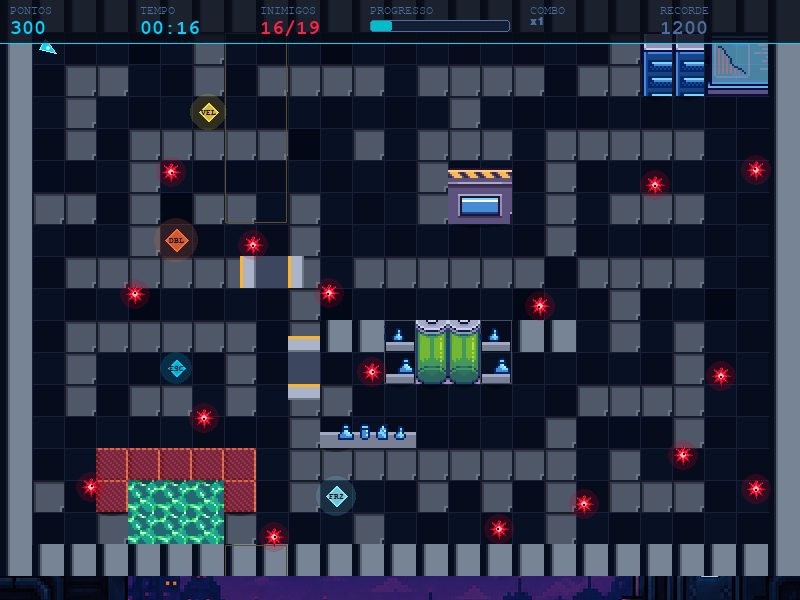
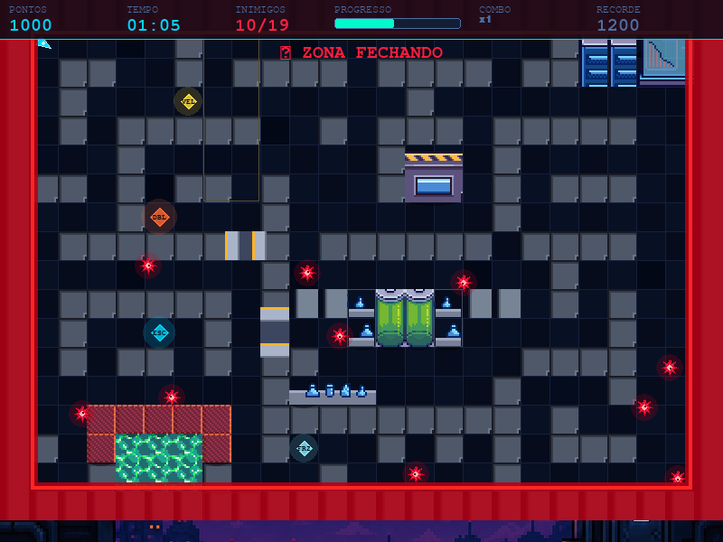

<div align="center">
  

  <p><strong>Um labirinto hostil. Impostores por toda parte. E uma zona vermelha que não espera por você.</strong></p>

  <p>
    
    
    
  </p>

  <p>
    <a href="https://julianacosta01.github.io/game-zerk/">
      
    </a>
  </p>
</div>

## Sobre

ZERK é um jogo 2D de ação e sobrevivência em labirinto, feito em Python com Pygame-ce. O objetivo é simples de entender e difícil de dominar: eliminar todos os impostores espalhados pelo mapa antes que a Zona Vermelha feche o espaço seguro.

Um único contato com um impostor sem escudo ativo, ou pisar dentro da zona, encerra a partida na hora. Isso empurra o jogo para decisões rápidas: por onde entrar, quando recuar, quando arriscar um power-up no meio do perigo.

O código segue arquitetura modular orientada a objetos, com responsabilidades bem separadas entre estado do jogo, inimigos, colisões, zona e interface. Pensado para ser fácil de manter e expandir.

## Capturas de tela

| Menu | Em partida | Zona Vermelha ativa |
|:---:|:---:|:---:|
|  |  |  |

## Funcionalidades

- Combate com mira livre: a direção do disparo segue o mouse em tempo real
- Impostores com movimentação autônoma: ficam mais rápidos e enxergam mais longe a cada nova partida
- Zona Vermelha dinâmica: ativada por tempo ou por número de impostores restantes, que fecha o mapa progressivamente
- Quatro power-ups temporários que mudam o ritmo do combate
- Combo de eliminações consecutivas com multiplicador de pontuação de até x10
- Recorde salvo localmente entre partidas
- Portas automáticas e cenário reativo, reforçando a sensação de ambiente vivo

## Como jogar

**Objetivo:** Elimine os 19 impostores do mapa antes que a Zona Vermelha tome o espaço seguro. Contato com um impostor sem escudo ativo, ou entrar na zona, é derrota imediata.

**Zona Vermelha:** Ativa após 30 segundos de partida ou quando restam 6 impostores ou menos. A partir daí, o espaço seguro encolhe continuamente em direção ao centro do mapa.

**Power-ups**

| Ícone | Efeito |
|---|---|
| `VEL` | Aumenta a velocidade do jogador |
| `DBL` | Disparo duplo |
| `ESC` | Escudo temporário contra inimigos e zona |
| `FRZ` | Congela o avanço da Zona Vermelha |

**Combo:** Eliminações em sequência, dentro de uma janela curta de tempo, aumentam o multiplicador de pontuação (de x1 até x10).

**Dificuldade progressiva:** A cada nova partida, os impostores ficam mais rápidos e enxergam mais longe, até um teto de dificuldade.

**Controles**

| Tecla | Ação |
|---|---|
| `W A S D` / setas | Mover |
| Mouse | Mirar |
| Clique esquerdo / Espaço | Atirar |
| Enter | Iniciar / reiniciar |
| Esc | Voltar ao menu |

## Como jogar no navegador

Sem instalar nada: **[julianacosta01.github.io/game-zerk](https://julianacosta01.github.io/game-zerk/)**.

O jogo roda direto no navegador via [pygbag](https://github.com/pygame-web/pygbag), que compila o Pygame para WebAssembly. A cada atualização enviada para o repositório, essa versão é reconstruída e publicada automaticamente.

## Como executar localmente

Requisitos: Python 3.10+ e pip.

```bash
git clone https://github.com/JulianaCosta01/game-zerk.git
cd game-zerk
pip install -r requirements.txt
python main.py
```

## Estrutura do projeto

```text
game-zerk/
├── main.py         # inicialização e loop principal
├── menu.py         # menu inicial
├── game_state.py   # coordenação dos sistemas do jogo
├── config.py       # configurações e constantes
├── tilemap.py      # labirinto e colisões
├── player.py       # jogador e projéteis
├── enemy.py        # comportamento dos inimigos
├── zone.py         # zona vermelha, power-ups e partículas
├── door.py         # portas automáticas
├── hud.py          # interface e telas de início/fim
├── audio.py        # gerenciamento de música e efeitos sonoros
├── save.json        # recorde salvo localmente
└── assets/           # imagens, música e efeitos sonoros
```

## Autores

Desenvolvido por **Juliana Ferreira Costa** e **João Amândio Avelar do Amaral**.

## Licença

Distribuído sob a licença MIT. Veja o arquivo [LICENSE](LICENSE) para mais detalhes.

Músicas, efeitos sonoros e demais recursos de terceiros permanecem sob os direitos de seus respectivos autores e licenciadores, utilizados conforme suas licenças de uso.
